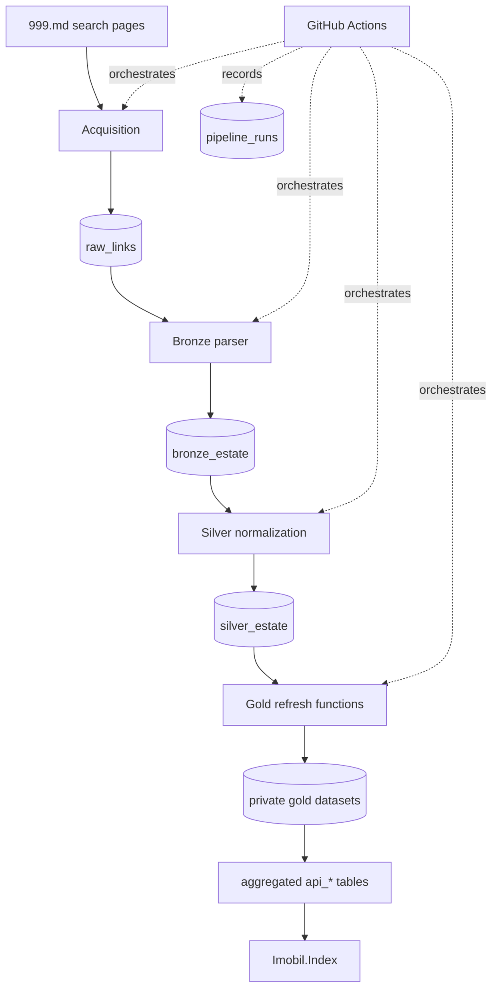

# Architecture

This document describes the current `real-estate-analytics-md` system. Future
ideas and implementation order belong in [PROGRESS.md](PROGRESS.md).

## System boundary

The Estate MD product is split across two repositories:

| Repository | Responsibility |
|---|---|
| `real-estate-analytics-md` | Produce trusted data: acquisition, Bronze, Silver, Gold, public API refresh, run metadata, and operational controls. |
| `Imobil-Index` | Consume aggregated `api_*` data and present it through Streamlit. |

The database currently uses prefixed objects in the Supabase `public` schema.
Moving layers into separate PostgreSQL schemas is not part of the current plan.

## End-to-end flow



## Layer contracts

### Acquisition / Raw

- **Main code:** `pipeline/acquisition/links_loader.py`
- **Main table:** `raw_links`
- **Grain:** one row per unique listing URL.

The collector scans 999.md result pages, retains numeric listing URLs, inserts
previously unseen links, and tracks processing status and attempts. Collection
is deliberately append-only. It does not establish whether a previously seen
listing is still active.

The collector runs sequentially (`MAX_WORKERS=1`), uses bounded retries, records
page diagnostics, and fails after three consecutive failed pages or an
excessive failed-page ratio.

### Bronze

- **Main code:** `pipeline/bronze/loader.py`, `pipeline/bronze/parsers.py`
- **Main table:** `bronze_estate`
- **Grain:** one parsed record per unique listing URL.

Bronze opens pending listing pages and preserves evidence close to the source:
text fields plus `price_json`, `main_features_json`, and
`additional_features_json`. It marks the corresponding Raw URL with the parser
outcome. Successful upserts are idempotent on URL.

### Silver

- **Main code:** `pipeline/silver/loader.py`,
  `pipeline/silver/normalizers.py`, `pipeline/silver/quality.py`
- **Main table:** `silver_estate`
- **Grain:** one normalized record per unique listing URL.

Silver converts source text and JSON into typed analytical fields for price,
publication date, address, dimensions, property characteristics, and boolean
amenities. `quality_score` measures completeness of selected fields and
`normalization_status` classifies the result.

The current loader fetches all Bronze records and upserts the full Silver
dataset on every run. This is reproducible and acceptable at the current scale,
but it is not incremental processing.

### Gold

- **Main code:** `pipeline/gold/aggregator.py`, `pipeline/gold/loader.py`
- **Main database functions:** `refresh_gold_estate()`, `refresh_gold_rent()`

Gold aggregates qualifying Silver listings into current market views and daily
snapshots for sale and rent. Grains vary by dataset and must be preserved
explicitly; examples include:

- sales history: `date + municipality + city + sector`;
- rent history: `date + municipality + city + sector + deal_type`.

The Python aggregator attempts both sales and rent refreshes, collects errors,
and raises a `RuntimeError` if either refresh fails. The run is marked successful
and `gold_refreshed=true` only after both RPC calls succeed.

The tracked `pipeline/gold/schema.sql` now bootstraps the five internal Gold
objects with the production filters and thresholds inspected on 2026-09-08. It
also records the required, non-alphabetical `sql/api` rollout order. It is a
clean-environment bootstrap source, not an automatic migration for an existing
database; live definitions must still be compared before applying changes.

### Public API

- **Main objects:** ten aggregated `api_*` tables
- **Consumer:** `Imobil-Index/dashboard_data.py`
- **Canonical contract:** `docs/public_api_v1.md`

The public API is a security and ownership boundary, not another raw data layer.
Public consumers receive only aggregated metrics. Public roles have read-only
access to intended `api_*` objects and no access to internal listing-level or
operational objects.

The deployed API SQL and detailed contract currently reside in the dashboard
repository. Moving and reconciling those files into this producer repository is
the next architecture task. Until that is complete, a clean checkout cannot
recreate the full deployed database contract from this repository alone.

## Operational control plane

GitHub Actions orchestrates four jobs:

```text
collect-links -> parse-bronze -> silver -> gold
```

The workflow runs daily at `01:00 UTC`, uses Python 3.11, restricts repository
permissions to read-only, and serializes runs with
`cancel-in-progress: false`.

All jobs derive the same identifier from `GITHUB_RUN_ID` and
`GITHUB_RUN_ATTEMPT`. The acquisition stage creates a `pipeline_runs` row;
later stages update it, and Gold writes the terminal status. The table is an
internal operational object protected from public roles.

Current observability limitations are explicit:

- Bronze and Silver counters are defined but not populated;
- eight historical interrupted runs remained `running` at the 2026-09-08 audit;
- manual cancellation has no automatic finalizer yet.

## Failure behavior

- Link collection and Bronze use `continue-on-error` only long enough to upload
  logs, then validation steps inspect the original step `outcome` and fail the
  job.
- Silver and Gold propagate exceptions directly.
- Failed downstream dependencies do not run.
- A final notification job sends a Telegram failure alert.
- Link, Bronze, and Gold logs are retained as workflow artifacts for seven days.

## Security boundary

- Pipeline jobs use server-side Supabase credentials supplied through GitHub
  Secrets or a local `.env` file.
- The dashboard must never receive the pipeline's privileged key.
- Public table exposure requires both table privileges and appropriate RLS
  policies; the two controls are reviewed together.
- Internal data and operations objects remain closed to public roles.
- Database function `search_path`, execution grants, RLS, indexes, and advisors
  must be checked against current production metadata before a schema change.

## Deliberate non-goals

- Airflow at the current workload and operational scale.
- Listing-level price history, removals, or time-on-market under append-only
  acquisition.
- Separate PostgreSQL schemas for every medallion layer.
- Splitting the wide Silver analytical table without query evidence.
- dbt, Polars, or DuckDB scaffolding without a real transformation, profiling,
  or reconciliation problem to solve.
- Predictive or AI-generated market claims before reliability and data quality
  are established.
