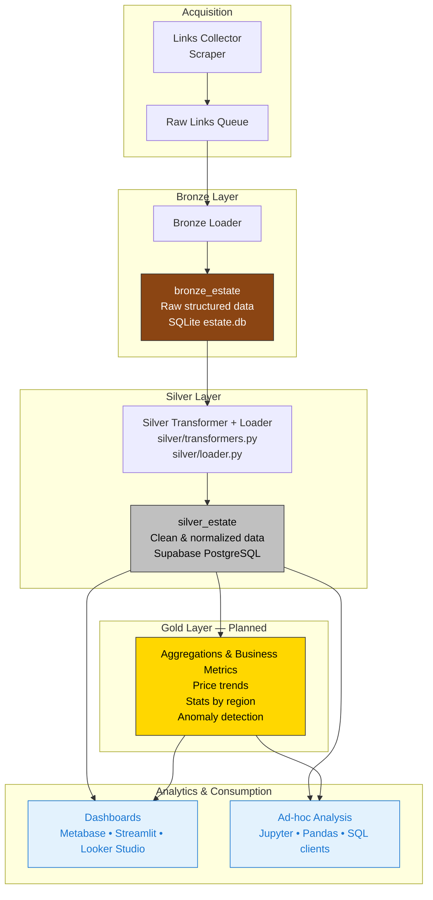

# 🏡 Real Estate Analytics MD

A modular data pipeline for collecting, transforming, and analyzing real estate listings in Moldova.

---

## Architecture Overview


---

## 🟤 Bronze Layer: Structured JSON

Unlike traditional bronze layers that store raw HTML or unprocessed data, this project stores **pre-parsed structured JSON** extracted from HTML listings. This ensures:

- ✅ No loss of semantic information  
- ✅ Easier debugging and reproducibility  
- ✅ Ready for downstream normalization  

Example record in `raw_estate`:

```json
{
  "price": "89 000 €",
  "location": "Chișinău, Botanica",
  "rooms": "2",
  "area": "54 m²",
  "floor": "3/5",
  "features": ["balcony", "elevator"]
}
```

---

## ⚙️ Technologies

- Python 3.11  
- SQLite  
- Supabase (Silver layer storage)  
- GitHub Actions (CI/CD orchestration)  
- Modular ETL structure (Bronze/Silver/Gold)  
- Jupyter notebooks for analysis  

---

## 🚀 Usage

```bash
# Run full pipeline locally
python scripts/run_links_loader.py
python scripts/run_bronze.py
python scripts/run_silver.py
# Gold layer is not yet implemented
```

Or let GitHub Actions run it daily via `.github/workflows/pipeline.yml`.

---

## 📊 Notebooks

- `price_analysis.ipynb`: price trends by region  
- `region_distribution.ipynb`: listing density  
- `feature_quality_check.ipynb`: data completeness  

---

## 📁 Data Storage

- `storage/estate.db`: SQLite database containing Bronze and Silver layers  
- `raw_links`: deduplicated queue of listing URLs  
- `bronze_estate`: structured JSON records  

---

✅ This version makes it clear that the Gold layer is **planned but not implemented yet**, while keeping the architecture and usage instructions consistent with your current pipeline.


# 🏡 Real Estate Analytics MD
