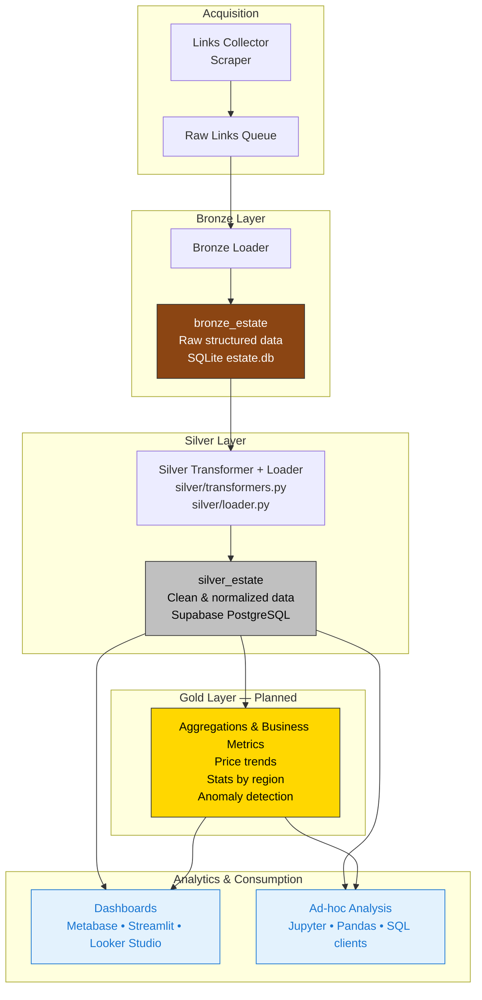

# 🏡 Real Estate Analytics MD

A modular data pipeline for collecting, transforming, and analyzing real estate listings in Moldova.

---

## Architecture Overview



---

## 🟤 Bronze Layer: Parsed Listings Table

Instead of storing raw HTML pages, the Bronze layer in this project captures **already parsed listings** in the relational table `bronze_estate`. Each record includes:

- 🔑 **id** — unique UUID  
- 🌐 **url** — link to the original listing  
- 🆔 **ad_id** — listing identifier on the platform  
- 📊 **status** — processing result (`success` / `error`)  
- 📅 **publication_date** — publication or update date  
- 👤 **user_login** — listing author  
- 📑 **deal_type** — type of deal (sale, rent, etc.)  
- 🗺️ **region** — region/address  
- 📝 **description** — textual description  
- 💰 **price_json** — JSON with prices in multiple currencies (`mdl`, `eur`, `usd`)  
- 🏠 **main_features_json** — JSON with main property features (rooms, floor, condition, etc.)  
- ➕ **additional_features_json** — JSON with extra options (heating, elevator, security, etc.)  
- ⏱️ **created_at** — timestamp when the record was inserted  

This design ensures:

- ✅ Semantic information is preserved without loss  
- ✅ Flexible downstream normalization and analytics  
- ✅ Easy debugging and reproducibility  

### Example record in `bronze_estate`

```json
{
  "id": "ad5898ad-38ac-4fec-964a-a4e59c717fd5",
  "url": "https://999.md/ru/100040456",
  "ad_id": "100040456",
  "status": "success",
  "publication_date": "Updated: Nov 24, 2025, 14:40",
  "user_login": "Mirax",
  "deal_type": "Sale",
  "region": "Chișinău mun., Durlești, Center, str. Alexandr Orlov",
  "description": "One-bedroom apartment with living room in Colina Verde Residence, Durlești...",
  "price_json": {"mdl": null, "eur": 77000, "usd": null},
  "main_features_json": {
    "listing_author": "Agency",
    "number_of_rooms": "1-room apartment",
    "housing_type": "New building",
    "floor": "3",
    "total_floors": "8",
    "apartment_condition": "Shell condition"
  },
  "additional_features_json": {
    "autonomous_heating": true,
    "double_glazing": true,
    "security_door": true,
    "intercom": true,
    "video_surveillance": true,
    "elevator": true,
    "playground": true
  },
  "created_at": "2025-11-24 12:54:41"
}
```

---

## ⚙️ Technologies

- Python 3.11  
- SQLite  
- Supabase (Silver layer storage)  
- GitHub Actions (CI/CD orchestration)  
- Modular ETL structure (Bronze/Silver/Gold)  
- Jupyter notebooks for analysis  

---

## 🚀 Usage

```bash
# Run full pipeline locally
python scripts/run_links_loader.py
python scripts/run_bronze.py
python scripts/run_silver.py
# Gold layer is not yet implemented
```

Or let GitHub Actions run it daily via `.github/workflows/pipeline.yml`.

---

## 📊 Notebooks

- `price_analysis.ipynb`: price trends by region  
- `region_distribution.ipynb`: listing density  
- `feature_quality_check.ipynb`: data completeness  

---

## 📁 Data Storage

- `storage/estate.db`: SQLite database containing Bronze and Silver layers  
- `raw_links`: deduplicated queue of listing URLs  
- `bronze_estate`: structured JSON records  

---

✅ This version makes it clear that the Gold layer is **planned but not implemented yet**, while keeping the architecture and usage instructions consistent with your current pipeline.

