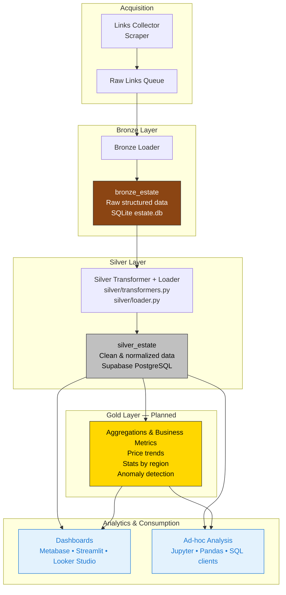

# 🏡 Real Estate Analytics MD

A modular data pipeline for collecting, transforming, and analyzing real estate listings in Moldova.

---

## Architecture Overview



---

## 🟤 Bronze Layer: Raw Structured Data

The Bronze layer stores **structured but unnormalized data** directly extracted from 999.md listings.  
Instead of keeping raw HTML (which is fragile and hard to query), we immediately parse the page and save all fields as structured text/JSON — preserving 100% of the original information while making it instantly queryable.

### Table: `bronze_estate` (SQLite → `storage/estate.db`)

| Column                    | Type        | Description                                                                 |
|---------------------------|-------------|-----------------------------------------------------------------------------|
| `id`                      | TEXT PK     | UUID for internal deduplication                                            |
| `url`                     | TEXT UNIQUE | Full URL of the listing (e.g. `https://999.md/ru/100011729`)                |
| `ad_id`                   | TEXT        | Original 999.md ad identifier                                              |
| `status`                  | TEXT        | `success` / `error`                                                         |
| `publication_date`        | TEXT        | Raw string like `Дата обновления:24 ноя. 2025, 14:45`                        |
| `user_login`              | TEXT        | Seller/agent username                                                       |
| `deal_type`               | TEXT        | "Продам" / "Сдаю посуточно" etc.                                            |
| `region`                  | TEXT        | Region (e.g. `Кишинёв мун., Центр`)                                         |
| `description`             | TEXT        | Full ad text                                                                |
| `price_json`              | TEXT (JSON) | `{"mdl": 1200, "eur": 77000, "usd": null}` — extracted prices               |
| `main_features_json`      | TEXT (JSON) | Raw main characteristics (rooms, floor, area, etc.)                         |
| `additional_features_json`| TEXT (JSON) | Raw boolean flags (elevator, autonomous heating, etc.)                      |
| `created_at`              | TIMESTAMP   | When the record was ingested                                                |

### Example real record (as stored in Bronze)

```json
{
  "id": "473f33f2-f600-430a-9614-db143a652255",
  "url": "https://999.md/ru/100011729",
  "ad_id": "100011729",
  "status": "success",
  "publication_date": "Дата обновления:24 ноя. 2025, 14:45",
  "user_login": "69719119",
  "deal_type": "Сдаю посуточно",
  "region": "Кишинёв мун., Кишинёв, Центр, str. Ismail, 88",
  "description": "Кишинев, str. Izmail 88( центр, кафе \" PizzaMania \" )квартира на 4 персоны...",
  "price_json": "{\"mdl\": 1200, \"eur\": null, \"usd\": null}",
  "main_features_json": "{\"listing_author\": \"Застройщик\", \"number_of_rooms\": \"2-х комнатная квартира\", \"floor\": \"5\", \"total_floors\": \"11\"}",
  "additional_features_json": "{}",
  "created_at": "2025-11-24 12:54:40"
}
```
---

## ⚙️ Technologies

- Python 3.11  
- SQLite  
- Supabase (Silver layer storage)  
- GitHub Actions (CI/CD orchestration)  
- Modular ETL structure (Bronze/Silver/Gold)  
- Jupyter notebooks for analysis  

---

## 🚀 Usage

```bash
# Run full pipeline locally
python scripts/run_links_loader.py
python scripts/run_bronze.py
python scripts/run_silver.py
# Gold layer is not yet implemented
```

Or let GitHub Actions run it daily via `.github/workflows/pipeline.yml`.

---

## 📊 Notebooks

- `price_analysis.ipynb`: price trends by region  
- `region_distribution.ipynb`: listing density  
- `feature_quality_check.ipynb`: data completeness  

---

## 📁 Data Storage

- `storage/estate.db`: SQLite database containing Bronze and Silver layers  
- `raw_links`: deduplicated queue of listing URLs  
- `bronze_estate`: structured JSON records  

---

✅ This version makes it clear that the Gold layer is **planned but not implemented yet**, while keeping the architecture and usage instructions consistent with your current pipeline.

