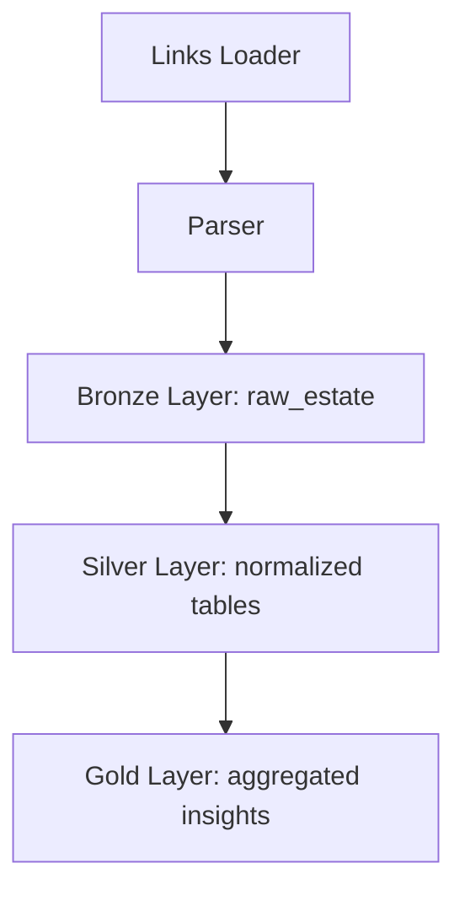

```markdown
# 🏡 Real Estate Analytics MD

A modular data pipeline for collecting, transforming, and analyzing real estate listings in Moldova.

---

## 🧱 Architecture Overview



---

## 🟤 Bronze Layer: Structured JSON

Unlike traditional bronze layers that store raw HTML or unprocessed data, this project stores **pre-parsed structured JSON** extracted from HTML listings. This ensures:

- ✅ No loss of semantic information
- ✅ Easier debugging and reproducibility
- ✅ Ready for downstream normalization

Example record in `raw_estate`:

```json
{
  "price": "89 000 €",
  "location": "Chișinău, Botanica",
  "rooms": "2",
  "area": "54 m²",
  "floor": "3/5",
  "features": ["balcony", "elevator"]
}
```

---

## ⚙️ Technologies

- Python 3.11
- SQLite
- GitHub Actions (CI + orchestration)
- Modular ETL structure (bronze/silver/gold)
- Jupyter notebooks for analysis

---

## 🚀 Usage

```bash
# Run full pipeline locally
python scripts/run_links_loader.py
python scripts/run_bronze.py
python scripts/run_silver.py
python scripts/run_gold.py
```

Or let GitHub Actions run it daily via `.github/workflows/pipeline.yml`.

---

## 📊 Notebooks

- `price_analysis.ipynb`: price trends by region
- `region_distribution.ipynb`: listing density
- `feature_quality_check.ipynb`: data completeness

---

## 📁 Data Storage

- `storage/estate.db`: SQLite database with all layers
- `raw_links`: deduplicated queue of listing URLs
- `raw_estate`: structured JSON records
```
